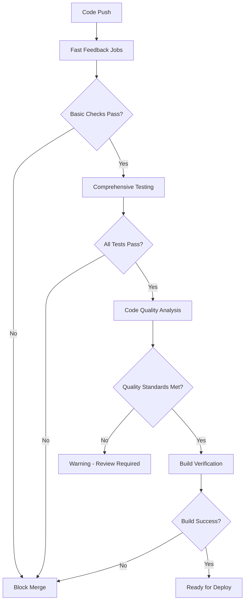

# CI/CD Quality Workflows Documentation

## Overview

This document details the comprehensive CI/CD quality workflows implemented for Curated.www. Our CI/CD pipeline enforces strict quality gates to ensure no substandard code reaches production.

## Workflow Architecture

### Pipeline Structure



## Workflow Jobs Breakdown

### 1. Fast Feedback Jobs (`lint-and-format`)
**Purpose**: Provide immediate feedback on basic code quality
**Runtime**: ~2-3 minutes
**Blocking**: Yes (prevents merge on failure)

#### Checks Performed:
- **RuboCop**: Ruby/Rails code style compliance
- **ERB Lint**: Template quality and consistency
- **JavaScript Linting**: Frontend code quality (ESLint)

#### Configuration:
```yaml
# CRITICAL: No continue-on-error - these MUST pass
- name: Run RuboCop
  run: bundle exec rubocop --format progress

- name: Run ERB Lint
  run: bundle exec erb_lint --lint-all

- name: Run JavaScript linting
  run: npm run lint

- name: Check Prettier formatting
  run: npm run format:check
```

#### Success Criteria:
- Zero RuboCop violations
- Clean ERB templates
- JavaScript code follows standards

### 2. Security Analysis (`security`)
**Purpose**: Identify security vulnerabilities before they reach production
**Runtime**: ~1-2 minutes
**Blocking**: Yes (for high/medium severity issues)

#### Checks Performed:
- **Brakeman**: Ruby/Rails security vulnerability scanning
- **Bundle Audit**: Gem dependency security check
- **NPM Audit**: JavaScript dependency security

#### Security Thresholds:
- **High Severity**: Blocking (must fix)
- **Medium Severity**: Blocking (must fix)
- **Low Severity**: Warning (review required)

#### Configuration:
```yaml
# CRITICAL: Brakeman and Bundle Audit MUST pass
- name: Run Brakeman
  run: bundle exec brakeman -q --no-pager

- name: Run Bundle Audit
  run: bundle exec bundle-audit check --update

# ADVISORY: NPM Audit (warnings only for moderate issues)
- name: Run NPM Audit
  run: npm audit --audit-level=high || echo "::warning::NPM audit found issues"
  continue-on-error: true
```

### 3. Comprehensive Test Suite (`test`)
**Purpose**: Validate functionality, coverage, and specialized requirements
**Runtime**: ~5-10 minutes
**Blocking**: Yes (100% test passage required)

#### Test Categories:

##### Core Tests (Blocking):
- **Unit Tests**: Models, services, helpers, decorators, policies
- **Integration Tests**: Controllers, requests, routing
- **Coverage Analysis**: 80% minimum threshold

##### Specialized Tests (Warning on failure):
- **Performance Tests**: Response time validation
- **Accessibility Tests**: WCAG 2.1 AA compliance via axe-core
- **i18n Tests**: Translation completeness and correctness

#### Database Setup:
```yaml
services:
  postgres:
    image: postgres:16
    env:
      POSTGRES_PASSWORD: password
      POSTGRES_DB: curated_test
    options: >-
      --health-cmd pg_isready
      --health-interval 10s
      --health-timeout 5s
      --health-retries 5
```

#### Test Execution Strategy:
```yaml
- name: Run RSpec tests (core)
  run: bundle exec rspec --exclude-pattern "spec/{performance,system,accessibility}/**/*_spec.rb"
  env:
    COVERAGE: true

- name: Run Performance tests
  run: bundle exec rspec spec/performance/
  continue-on-error: true

- name: Run Accessibility tests
  run: bundle exec rspec spec/system/accessibility_spec.rb
  continue-on-error: true

- name: Run i18n tests
  run: bundle exec rspec spec/i18n_spec.rb
  continue-on-error: true
```

### 4. Code Quality Analysis (`code-quality`)
**Purpose**: Deep analysis for maintainability and best practices
**Runtime**: ~3-5 minutes
**Blocking**: No (warnings and recommendations)

#### Analysis Tools:

##### Rails Best Practices:
- Identifies Rails anti-patterns
- Suggests improvements
- Checks for performance issues

##### SOLID Principles Validation:
- Single Responsibility: Large class detection
- Open/Closed: Dependency analysis
- Liskov Substitution: Interface compliance
- Interface Segregation: Method usage analysis
- Dependency Inversion: Direct database call detection

##### SEO Optimization Analysis:
- Meta tags implementation check
- XML sitemap generation validation
- Structured data (JSON-LD) verification
- Open Graph and Twitter Card compliance
- Canonical URL implementation

##### i18n Health Analysis:
```bash
bundle exec i18n-tasks health --format json
bundle exec i18n-tasks missing --format json
bundle exec i18n-tasks unused --format json
```

##### Code Complexity (Flog):
- Measures method complexity
- Identifies refactoring candidates
- Tracks complexity trends

##### Dead Code Detection (Debride):
- Finds unused methods
- Identifies potential cleanup opportunities
- Maintains lean codebase

#### PR Comment Integration:
Results are automatically commented on pull requests:

```yaml
- name: Comment on PR with quality issues
  uses: actions/github-script@v7
  with:
    script: |
      # Parse quality results and post summary
      # Includes Rails Best Practices issues
      # Shows i18n problems
      # Highlights complexity concerns
```

### 5. Build Verification (`build`)
**Purpose**: Ensure production build succeeds
**Runtime**: ~2-3 minutes
**Blocking**: Yes (production deployment readiness)

#### Build Steps:
```yaml
- name: Install production dependencies
  run: |
    bundle install --without development test
    npm ci

- name: Build assets
  run: |
    npm run build
    npm run build:css

- name: Precompile assets
  run: bundle exec rails assets:precompile
  env:
    RAILS_ENV: production
    SECRET_KEY_BASE: dummy_key_for_build
```

#### Success Criteria:
- Clean dependency installation
- Successful asset compilation
- No build errors or warnings

### 6. CI Summary (`ci-summary`)
**Purpose**: Provide comprehensive pipeline overview
**Runtime**: ~1 minute
**Blocking**: No (informational)

Generates detailed status summary showing:
- Individual job results
- Quality gate status
- Artifact availability
- Recommendations for improvement

## Quality Gates and Thresholds

### Critical Gates (Must Pass):
1. **Lint & Format**: 100% compliance required
2. **Security**: Zero high/medium vulnerabilities
3. **Core Tests**: 100% passage, 80% coverage minimum
4. **Build**: Must complete successfully

### Warning Gates (Review Required):
1. **Code Quality Issues**: Rails Best Practices violations
2. **Performance Regressions**: Slower than baseline
3. **Accessibility Issues**: WCAG compliance failures
4. **i18n Problems**: Missing/unused translations

### Informational (Tracking):
1. **Complexity Metrics**: Flog scores and trends
2. **Dead Code**: Unused method identification
3. **Coverage Trends**: Coverage percentage changes

## Artifact Management

### Collected Artifacts:
- **Lint Results**: `rubocop-results.json`, `erb-lint-results.json`
- **Security Reports**: `brakeman-results.json`, `npm-audit-results.json`
- **Test Results**: `rspec-results.json`, coverage reports
- **Quality Analysis**: All quality tool outputs
- **Build Artifacts**: Compiled assets and build outputs

### Artifact Retention:
- **7 days**: Test results and coverage
- **30 days**: Security scan results
- **90 days**: Quality analysis reports

## Branch Protection Rules

### Required Status Checks:
```yaml
required_status_checks:
  strict: true
  contexts:
    - "lint-and-format"
    - "security"
    - "test"
    - "build"
```

### Additional Requirements:
- **Up-to-date branch**: Must be current with main
- **Code review**: At least one approval required
- **No merge conflicts**: Branch must be clean
- **Dismiss stale reviews**: On new commits

## Performance Optimization

### Parallel Execution:
- Lint and Security jobs run in parallel
- Independent quality checks parallelized
- Artifact uploads happen asynchronously

### Caching Strategy:
```yaml
- name: Cache Ruby gems
  uses: ruby/setup-ruby@v1
  with:
    bundler-cache: true

- name: Cache Node modules
  uses: actions/setup-node@v4
  with:
    cache: 'npm'
```

### Resource Allocation:
- **Fast feedback**: 2 CPU cores, 4GB RAM
- **Test suite**: 4 CPU cores, 8GB RAM
- **Build verification**: 2 CPU cores, 4GB RAM

## Monitoring and Alerting

### CI/CD Metrics Tracking:
- Pipeline success/failure rates
- Average pipeline duration
- Quality gate failure patterns
- Security issue discovery rates

### Alerting Thresholds:
- **Pipeline failure rate > 10%**: Daily alert
- **Security issues found**: Immediate notification
- **Coverage below 75%**: Weekly report
- **Performance regression**: Immediate alert

## Maintenance and Updates

### Weekly Tasks:
- Review failed pipeline patterns
- Update quality tool configurations
- Address recurring quality issues
- Monitor performance trends

### Monthly Tasks:
- Update CI/CD dependencies
- Review and optimize pipeline performance
- Analyze quality metrics trends
- Update documentation

### Quarterly Tasks:
- Major tool version updates
- Pipeline architecture review
- Quality standard reassessment
- Team training updates

## Troubleshooting Common Issues

### RuboCop Failures:
```bash
# Auto-fix safe violations
bundle exec rubocop -A

# Check specific files
bundle exec rubocop app/models/listing.rb

# Generate todo list for large changes
bundle exec rubocop --auto-gen-config
```

### Test Failures:
```bash
# Run specific failing test
bundle exec rspec spec/models/listing_spec.rb:45

# Run with detailed output
bundle exec rspec --format documentation

# Check coverage report
open coverage/index.html
```

### Security Issues:
```bash
# Update vulnerable gems
bundle update --conservative

# Review specific Brakeman warning
bundle exec brakeman -w 1

# Check for new vulnerabilities
bundle exec bundle-audit check --update
```

### Build Failures:
```bash
# Clear asset cache
rails assets:clobber

# Rebuild with verbose output
RAILS_ENV=production rails assets:precompile --trace

# Check Node dependencies
npm audit fix
```

## Local Development Integration

### Pre-commit Integration:
```bash
# Install pre-commit hooks
# Add to .git/hooks/pre-commit:
#!/bin/bash
./script/dev/quality
```

### IDE Integration:
- **VSCode**: RuboCop extension for real-time feedback
- **RubyMine**: Built-in quality tool integration
- **Vim/Neovim**: ALE plugin for linting

### Quality Dashboard:
Access comprehensive quality metrics and trends at:
- Local: `http://localhost:3000/ops/quality` (admin only)
- CI Results: GitHub Actions tab with detailed reports

## Security Considerations

### Secret Management:
- No secrets in CI configuration
- Use GitHub Secrets for sensitive data
- Rotate secrets regularly

### Access Control:
- Quality tools run in isolated environments
- No production data access in CI
- Audit logs for all quality checks

### Compliance:
- SOC 2 Type II compliance considerations
- GDPR compliance for EU data
- Accessibility compliance (WCAG 2.1 AA)

## Future Enhancements

### Planned Improvements:
1. **Visual Regression Testing**: Automated UI change detection
2. **Load Testing**: Automated performance benchmarking
3. **Dependency Scanning**: Advanced supply chain security
4. **Code Quality Trends**: Historical analysis and forecasting

### Integration Roadmap:
- **SonarQube**: Advanced code quality metrics
- **Snyk**: Enhanced security scanning
- **Lighthouse CI**: Performance and accessibility automation
- **CodeClimate**: Code maintainability scoring

This CI/CD quality workflow ensures that every change to Curated.www meets our high standards for security, performance, accessibility, and maintainability.